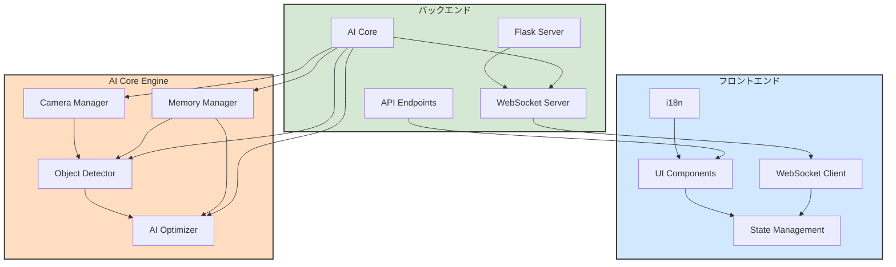

# 監視ちゃん (KanshiChan) - AI作業集中支援ツール

 <!-- TODO: Add a proper banner image -->

「監視ちゃん」は、AIを活用してユーザーの作業集中をサポートするインテリジェントなデスクトップアプリケーションです。リアルタイムで「人」と「スマートフォン」を検出し、作業の中断や集中力の低下につながる行動を分析・通知することで、生産性の向上を支援します。

## 🌟 主な特徴

- **🧠 AIによるリアルタイム監視:**
  - **物体検出:** `YOLOv8` と `MediaPipe` を統合し、カメラ映像から「人物」と「スマートフォン」をリアルタイムに検出します。
  - **状態分析:** ユーザーの離席（不在）、スマートフォン利用などの状態を自動で分析・記録します。
- **🚀 パフォーマンス最適化:**
  - **AIオプティマイザ:** FPS（フレームレート）に基づいて動的に推論処理を調整し、CPU負荷を最小限に抑えます。
  - **メモリ管理:** フレームキャッシュや定期的なガベージコレクションにより、安定した長時間動作を実現します。
- **🌐 多言語 & 音声通知:**
  - **国際化対応:** UIは日本語と英語に完全対応 (`i18next`)。
  - **音声アラート:** `Zonos TTS` を活用した自然な音声で、離席やスマホ利用をリアルタイムに通知します。
- **📊 高度なダッシュボード:**
  - **リアルタイム表示:** 監視状況、検出ログ、パフォーマンス統計（FPS、メモリ使用量）をリアルタイムに可視化します。
  - **インタラクティブUI:** `React` と `Chakra UI` で構築された、モダンで直感的なユーザーインターフェース。
- **🔧 高い拡張性と保守性:**
  - **モジュラー設計:** 機能ごとに整理された明確なプロジェクト構造。
  - **厳格な規約:** `project_rules/` に基づく統一された開発規約により、品質と保守性を担保します。

## 🖼️ アーキテクチャ

KanshiChanは、Python/Flaskで構築されたバックエンドと、React/TypeScriptで構築されたフロントエンドが連携して動作します。



## 🛠️ 技術スタック

| カテゴリ       | 技術                                                                                                       |
| :------------- | :--------------------------------------------------------------------------------------------------------- |
| **バックエンド** | `Python 3.9+`, `Flask`, `Flask-SocketIO`, `OpenCV`, `YOLOv8`, `MediaPipe`, `Zonos TTS`, `Ollama`             |
| **フロントエンド** | `React 19`, `TypeScript 5.7+`, `Vite`, `Chakra UI`, `i18next`, `Socket.IO Client`, `Framer Motion`           |
| **コード品質**   | `Black`, `Flake8`, `mypy` (Python), `ESLint`, `Prettier` (TypeScript)                                        |
| **テスト**     | `pytest` (Backend), `Vitest`, `React Testing Library` (Frontend)                                             |
| **CI/CD**      | `GitHub Actions`                                                                                           |
| **規約管理**   | `YAML` で定義されたプロジェクト規約                                                                        |

## 📂 ディレクトリ構造

```
KanshiChan/
├── backend/
│   ├── src/
│   │   ├── config/         # ⚙️ 設定ファイル (config.yaml)
│   │   ├── core/           # 🧠 AIコアエンジン (検出, 最適化)
│   │   ├── services/       # 🚀 外部連携サービス (TTS)
│   │   ├── web/            # 🌐 Web API (Flask, WebSocket)
│   │   ├── utils/          # 🛠️ 共通ユーティリティ (ロガー, 例外処理)
│   │   └── main.py         # ▶️ アプリケーション起動スクリプト
│   └── tests/
├── frontend/
│   ├── src/
│   │   ├── components/     # 🎨 Reactコンポーネント
│   │   ├── utils/          # 🛠️ 共通ユーティリティ (WebSocket通信)
│   │   ├── i18n/           # 🌍 国際化ファイル (ja.json, en.json)
│   │   ├── assets/         # 🖼️ 静的アセット
│   │   └── main.tsx        # ▶️ Reactアプリ起動スクリプト
│   └── tests/
├── project_rules/          # 📜 プロジェクト規約 (YAMLで定義)
├── docs/                   # 📚 ドキュメント
├── .github/                # 🤖 CI/CD (GitHub Actions)
└── README.md               # 👈 このファイル
```

## 🚀 セットアップ & 実行方法

### 1. 前提条件

- `Python 3.9`以上
- `Node.js 18`以上
- `Poetry` (Pythonパッケージ管理)
- `pnpm` (Node.jsパッケージ管理)

### 2. リポジトリのクローン

```bash
git clone https://github.com/your-username/KanshiChan.git
cd KanshiChan
```

### 3. バックエンドのセットアップ

```bash
cd backend
poetry install
```

### 4. フロントエンドのセットアップ

```bash
cd frontend
pnpm install
```

### 5. アプリケーションの実行

**ターミナル1: バックエンドサーバーの起動**
```bash
cd backend
poetry run python src/main.py
```
バックエンドサーバーが `http://localhost:8000` で起動します。

**ターミナル2: フロントエンド開発サーバーの起動**
```bash
cd frontend
pnpm dev
```
フロントエンド開発サーバーが `http://localhost:5173` で起動します。ブラウザでこのアドレスにアクセスしてください。

## 📖 開発規約

本プロジェクトでは、品質と一貫性を保つために厳格な開発規約を設けています。開発に参加する際は、必ず以下の規約を確認してください。

- **[📜 プロジェクト規約 README](project_rules/README.md):** 全規約の概要と使い方
- **[🌟 メイン規約](project_rules/main_rules.yaml):** 技術スタック、命名規則など
- **[💻 コーディング規約](project_rules/coding_rules.yaml):** 全言語共通のスタイルガイド
- **[🐍 バックエンド規約](project_rules/backend_rules.yaml):** Python/Flask固有のルール
- **[⚛️ フロントエンド規約](project_rules/frontend_rules.yaml):** React/TypeScript固有のルール
- **[🤖 AI/ML規約](project_rules/ai_ml_rules.yaml):** YOLO/MediaPipeに関するルール

## 🤝 貢献

貢献を歓迎します！Issueの起票やPull Requestをお待ちしています。

## 📄 ライセンス

このプロジェクトは [MITライセンス](LICENSE) の下で公開されています。
