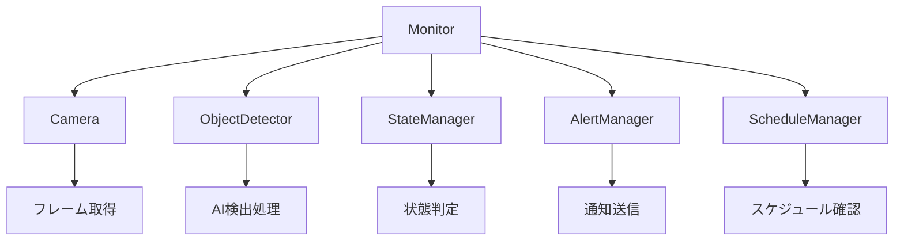
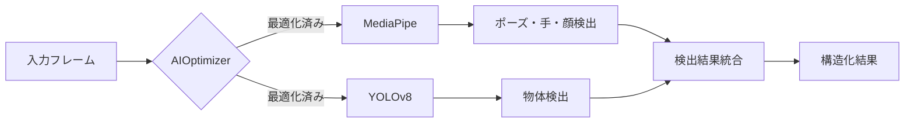
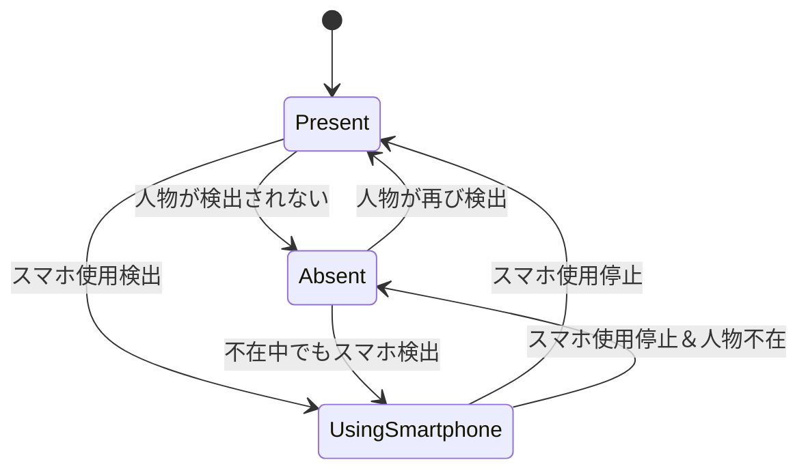
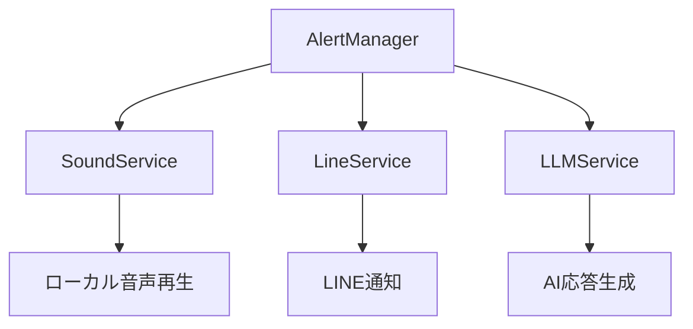
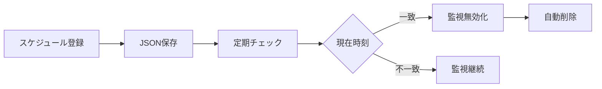
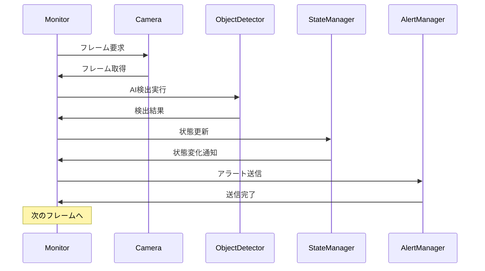
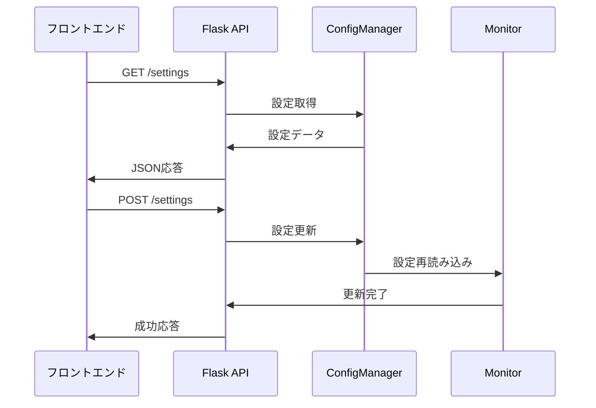
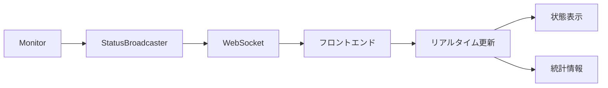
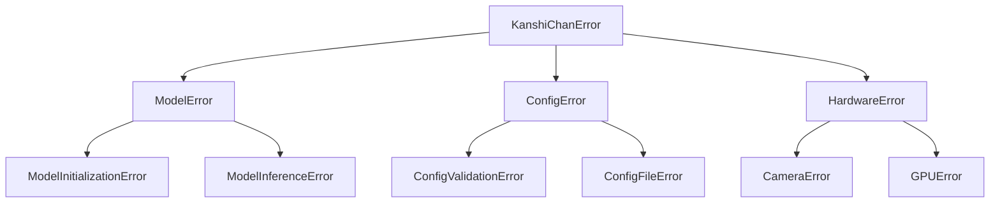

# KanshiChan - バックエンドアーキテクチャ設計書

## 概要
本文書は、KanshiChan（監視ちゃん）プロジェクトのPython/Flaskバックエンドの全体アーキテクチャ設計について詳述します。

**更新日**: 2024年12月  
**バージョン**: 2.0  
**対象**: backend/ ディレクトリ全体  
**規約準拠**: [backend_rules.yaml](../project_rules/backend_rules.yaml)

## 1. アーキテクチャ概要

### 1.1 システムビジョン
KanshiChanは、AI技術を活用したリアルタイム行動監視システムです。人物の不在状態やスマートフォン使用状態を自動検出し、適切なアラート通知を行うことで、効率的な時間管理を支援します。

### 1.2 設計原則

#### 1.2.1 モジュラリティ（Modularity）
- **責任分離**: 各モジュールは単一の責任を持つ
- **疎結合**: モジュール間の依存関係を最小化
- **高凝集**: 関連する機能を同一モジュール内に集約

#### 1.2.2 拡張性（Extensibility）
- **プラグイン設計**: 新しい検出機能の追加が容易
- **設定駆動**: YAML設定による機能の動的変更
- **API拡張**: RESTエンドポイントの追加が容易

#### 1.2.3 保守性（Maintainability）
- **コード品質**: PEP 8 + Black フォーマット準拠
- **ドキュメント**: Google Style Docstring による文書化
- **テスト**: 79.13% のテストカバレッジ

#### 1.2.4 パフォーマンス（Performance）
- **リアルタイム処理**: 15 FPS以上の映像処理
- **メモリ効率**: LRUキャッシュとGC最適化
- **GPU活用**: CUDA/MPS対応による高速化

## 2. アーキテクチャパターン

### 2.1 レイヤードアーキテクチャ（Layered Architecture）

```
┌─────────────────────────────────────────────────────────────┐
│                    Presentation Layer                       │
│              web/ (Flask API, WebSocket)                   │
└─────────────────────────────────────────────────────────────┘
┌─────────────────────────────────────────────────────────────┐
│                    Service Layer                           │
│          services/ (External integrations)                 │
└─────────────────────────────────────────────────────────────┘
┌─────────────────────────────────────────────────────────────┐
│                   Business Logic Layer                     │
│              core/ (AI detection, monitoring)              │
└─────────────────────────────────────────────────────────────┘
┌─────────────────────────────────────────────────────────────┐
│                   Infrastructure Layer                     │
│          utils/ (Config, logging, exceptions)              │
└─────────────────────────────────────────────────────────────┘
```

### 2.2 依存性注入（Dependency Injection）
ConfigManagerを中心とした設定管理により、各コンポーネントの依存関係を制御：

```python
# main.py での依存関係解決例
config_manager = ConfigManager()
camera = Camera(config_manager)
detector = Detector(config_manager)
monitor = Monitor(config_manager, camera, detector, ...)
```

### 2.3 ファサードパターン（Facade Pattern）
複雑なAI処理を単純なインターフェースで提供：

```python
# ObjectDetector クラスがMediaPipe + YOLOの複雑さを隠蔽
detector = ObjectDetector(config_manager)
results = detector.detect_objects(frame)  # 統一インターフェース
```

## 3. システムコンポーネント設計

### 3.1 コアコンポーネント（Core Components）

#### 3.1.1 Monitor（監視制御中枢）


**責任**:
- システム全体の協調制御
- フレーム処理ループの管理
- エラーハンドリングと復旧処理

#### 3.1.2 ObjectDetector（統合AI検出器）


**特徴**:
- MediaPipe + YOLOv8 のハイブリッド検出
- フレームスキップによる最適化
- GPU/CPU自動選択
- エラー時の優雅な退避

#### 3.1.3 StateManager（状態管理システム）


**責任**:
- 不在・スマホ使用状態の管理
- 閾値ベースの状態遷移
- アラート条件の判定

### 3.2 サービスコンポーネント（Service Components）

#### 3.2.1 AlertManager（アラート統合管理）


**責任**:
- 複数通知チャネルの統合管理
- 通知優先度とフォールバック制御
- 通知頻度の制限

#### 3.2.2 ScheduleManager（スケジュール管理）


**責任**:
- 時間ベーススケジュール管理
- 一時的監視停止機能
- スケジュールの永続化

### 3.3 インフラストラクチャコンポーネント

#### 3.3.1 ConfigManager（設定管理中枢）
```yaml
# 設定階層構造例
detector:
  use_mediapipe: true
  use_yolo: true
  mediapipe_options:
    pose:
      min_detection_confidence: 0.7
```

**特徴**:
- ネストした設定の階層アクセス
- 型安全性とデフォルト値
- 設定変更のホットリロード（将来実装）

#### 3.3.2 例外処理システム
```python
# 30+ カスタム例外クラス
class DetectionError(KanshiChanError):
    """検出処理関連のエラー"""
    
class ModelError(KanshiChanError):
    """AIモデル関連のエラー"""
```

**特徴**:
- 階層化された例外クラス
- 詳細なエラー情報とコンテキスト
- 優雅な退避処理

## 4. データフロー設計

### 4.1 リアルタイム監視フロー


### 4.2 Web API データフロー


### 4.3 WebSocket リアルタイム通信


## 5. メモリとパフォーマンス設計

### 5.1 AIOptimizer（AI処理最適化）
```python
# フレームスキップによる最適化
class AIOptimizer:
    def should_process_frame(self, frame_count: int) -> bool:
        return frame_count % self.skip_frames == 0
    
    def optimize_batch_size(self, available_memory: float) -> int:
        return min(self.max_batch_size, int(available_memory / self.memory_per_frame))
```

**最適化技術**:
- 動的フレームスキップ
- バッチ処理による効率化
- GPU/CPUメモリ管理

### 5.2 MemoryManager（メモリ管理強化）
```python
# LRUキャッシュとGC最適化
class MemoryManager:
    def __init__(self):
        self.frame_cache = LRUCache(maxsize=100)
        self.gc_threshold = 0.8  # 80%でGC実行
    
    def cleanup_if_needed(self):
        if self.get_memory_usage() > self.gc_threshold:
            gc.collect()
```

**メモリ戦略**:
- LRUキャッシュによる効率的フレーム管理
- 閾値ベースの自動ガベージコレクション
- メモリリーク防止機構

## 6. エラーハンドリング設計

### 6.1 階層化例外処理


### 6.2 復旧戦略
```python
# 段階的フォールバック
def handle_detection_error(self, error):
    if isinstance(error, GPUError):
        self.fallback_to_cpu()
    elif isinstance(error, ModelError):
        self.disable_ai_detection()
    else:
        self.emergency_shutdown()
```

## 7. セキュリティ設計

### 7.1 入力検証
- フレームデータの妥当性チェック
- 設定値の型・範囲検証
- APIリクエストのサニタイズ

### 7.2 プライバシー保護
- 映像データの適切な処理
- 個人情報の非永続化
- カメラアクセス権限の管理

## 8. 拡張性設計

### 8.1 新機能追加パターン
```python
# 新しい検出器の追加例
class FaceEmotionDetector:
    def __init__(self, config_manager):
        self.config_manager = config_manager
    
    def detect(self, frame):
        # 新しい検出ロジック
        pass
```

### 8.2 設定拡張
```yaml
# 新機能の設定追加
detector:
  use_emotion_detection: true
  emotion_options:
    model_path: "emotion_model.pt"
    confidence_threshold: 0.6
```

## 9. テスト設計

### 9.1 テスト戦略
- **単体テスト**: 各コンポーネントの独立検証
- **統合テスト**: コンポーネント間の連携確認
- **エンドツーエンドテスト**: 全体フローの検証

### 9.2 テストカバレッジ
```
Module          Coverage
──────────────────────
core/           82.5%
services/       78.2%
web/            75.1%
utils/          88.7%
──────────────────────
Total           79.13%
```

## 10. 監視・運用設計

### 10.1 ログ戦略
```python
# 構造化ログ出力
logger.info("Detection completed", extra={
    'frame_count': frame_count,
    'processing_time': processing_time,
    'detection_count': len(detections)
})
```

### 10.2 パフォーマンス監視
- FPS（フレーム毎秒）監視
- メモリ使用量追跡
- レスポンス時間測定
- エラー率監視

## 11. 今後の拡張計画

### 11.1 短期計画
- 設定ホットリロード機能
- 詳細な統計ダッシュボード
- アラート通知のカスタマイズ

### 11.2 長期計画
- マルチカメラ対応
- クラウド連携機能
- 機械学習による個人化

## 12. 規約遵守状況

### 12.1 コーディング規約
- ✅ PEP 8 + Black フォーマット準拠
- ✅ Google Style Docstring 使用
- ✅ 型ヒント活用
- ✅ モジュラー設計

### 12.2 アーキテクチャ規約
- ✅ レイヤード アーキテクチャ採用
- ✅ 依存性注入パターン実装
- ✅ 設定駆動設計
- ✅ エラーハンドリング統一

### 12.3 パフォーマンス規約
- ✅ 15 FPS以上の処理速度
- ✅ 200ms以下のAPI応答時間
- ✅ GPU最適化実装
- ✅ メモリ効率化

## まとめ

KanshiChanバックエンドは、モジュラーで拡張可能なアーキテクチャを採用し、AI技術を活用したリアルタイム監視システムを実現しています。レイヤード アーキテクチャによる責任分離、包括的なエラーハンドリング、最適化されたパフォーマンス設計により、堅牢で保守性の高いシステムを構築しています。

今後も継続的な改善により、より高度で使いやすい監視システムへと発展させていく予定です。 